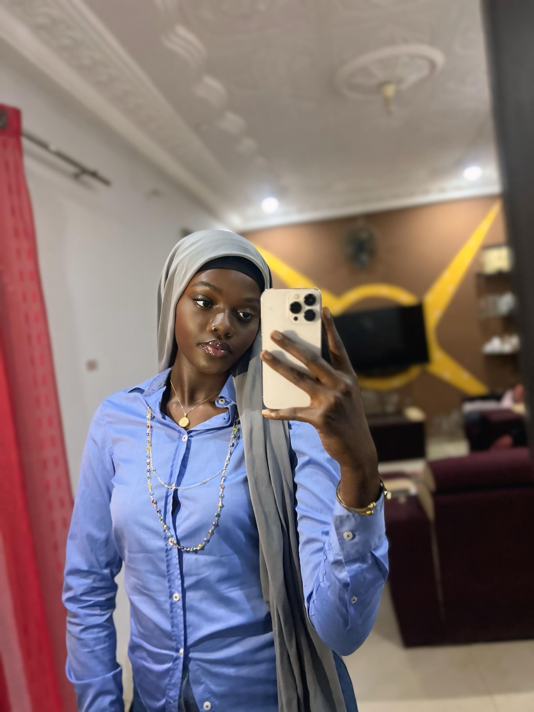

<!DOCTYPE html>
<html lang="fr">
<head>
    <meta charset="UTF-8">
    <title>Mon site personnel</title>
    <link rel="stylesheet" href="style.css">
</head>
<body>

<header>
    
    <h1>Ndeye Mariama BADJI</h1>
    
Bienvenue sur mon site personnel

</header>

<section>
    <h2>Présentation</h2>
    

        Je m’appelle Ndeye Mariama BADJI. Je suis de nationalité Sénégalaise et je suis née le 26 Mars 2007 à Dakar. Actuellement j'habite à Rufisque plus précisément à keur massar. Je suis célibataire, et à l'heure qu'il est, je suis entrain de poursuivre mes études, suite à l'obtention de mon baccalauréat ce juillet 2025, dans une école de formation. Après ma formation, j'aspire à travailler dans une entreprise en tant Directrice des Ressources Humaines (DRH) ou même en tant une Gestionnaire RH. 
    

</section>

<section>
    <h2>Mon CV</h2>
    <ul>
        <li>🎓 Formation : Licence 1 en Gestion des Ressources Humaines. </li>
        <li>💻 Compétences : La gestion du temps, l'esprit d'équipe, l'adaptabilité, la communication, l'esprit critique et l'organisation. </li>
        <li>🌍 Langues : Français, Anglais, Wolof</li>
    </ul>
</section>

<section>
    <h2>Mes hobbies</h2>
    
J’aime apprendre de nouvelles choses, notamment dans le domaine du numérique, qui m’attire beaucoup. Pendant mon temps libre, ou même lorsque je fais le ménage ou que je suis occupée, j’apprécie écouter de la musique. Cela me permet de me faire plaisir et d’éviter l’ennui.

J’aime également lire des chroniques, en particulier sur l’application Wattpad. J’y passe du temps pour découvrir de nouvelles cultures, développer mon imagination et enrichir mes compétences personnelles.
A mes heures perdues, c'est à dire lorsque je n'etudie pas, je passe mon temps à naviguer sur les réseaux sociaux notamment dans les applications comme Whatsapp, Instagram, Tiktok,…

</section>

<section>
    <h2>Mes passions</h2>
    
La cuisine et aussi la decouverte et l'apprentissage. 
    En premier lieu, nous avons la cuisine. La cuisine est l’une de mes passions, car elle me permet d’exprimer ma créativité et de partager des moments de plaisir. J’aime préparer des plats avec soin, découvrir de nouvelles recettes et expérimenter différentes saveurs. Cuisiner est pour moi une façon de me détendre, mais aussi de valoriser la richesse culturelle à travers les traditions culinaires. Cette passion m’apprend la patience, l’organisation et le sens du détail, des qualités que j’applique également dans les autres domaines de ma vie.
    En second lieu nous avons la decouverte et l'apprentissage. La découverte et l’apprentissage font partie de mes plus grandes passions. J’aime constamment acquérir de nouvelles connaissances, que ce soit dans le domaine du numérique ou à travers la lecture. Découvrir de nouvelles cultures, comprendre de nouveaux concepts et développer mes compétences personnelles me motive au quotidien. Cette passion me pousse à être curieuse, persévérante et toujours ouverte aux nouvelles opportunités.

</section>

<section>
    <h2>Ma culture</h2>
    

        De nationalité sénégalaise, je suis aussi diola et  originaire de la casamance. La culture diola, originaire de la région de la Casamance au sud du Sénégal, est une culture riche, authentique et profondément attachée aux traditions. Elle se caractérise par un fort respect des valeurs communautaires, de la nature et des ancêtres. Chez les Diolas, la solidarité, le partage et l’entraide occupent une place essentielle dans la vie quotidienne.

L’agriculture, notamment la culture du riz, est au cœur de la société diola et représente bien plus qu’une activité économique : elle est un symbole d’identité et de lien avec la terre. Les cérémonies traditionnelles, les danses, les chants et les rites initiatiques jouent également un rôle important dans la transmission des valeurs culturelles de génération en génération.

La culture diola se distingue aussi par sa diversité linguistique, son artisanat et sa cuisine traditionnelle, qui reflètent l’histoire et la richesse culturelle de la Casamance. C’est une culture vivante, fière de ses origines, qui continue de se préserver tout en s’adaptant au monde moderne.

    

</section>

<footer>
    
© 2026 - Ndeye Mariama Badji

</footer>

</body>
</html>
body {
    font-family: Arial, sans-serif;
    margin: 0;
    background-color: #f4f4f4;
    text-align: center;
}

header {
    background-color: #2c3e50;
    color: white;
    padding: 30px;
}

.photo {
    width: 150px;
    height: 150px;
    border-radius: 50%;
    object-fit: cover;
    border: 4px solid white;
}

section {
    background: white;
    margin: 20px;
    padding: 20px;
    border-radius: 10px;
}

footer {
    background-color: #2c3e50;
    color: white;
    padding: 10px;
}
http://localhost:7700/photo.jpg?b=1770124065259
